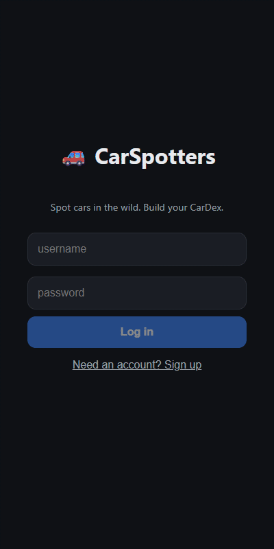

# CarSpotters

A Pokémon-Go-style game for cars: photograph a car in the wild, a computer-vision
model identifies the make and model, and it's added to your collection ("CarDex")
with a rarity tier based on how rare it is to spot.

> **Showcase repository.** This is a public, read-only snapshot of the source for
> portfolio purposes. Trained model weights, training data, and internal planning
> notes are not included. See [License](#license).

## Demo



Recorded from the app running locally: two cars the model recognizes, one it
doesn't (which goes to the "label it" flow), then the resulting CarDex. The
photos are public-domain and CC0 images from Wikimedia Commons.

## Highlights

- **Computer vision:** EfficientNet-B4 fine-tuned on ~300k images across 1,173
  make/model classes (Stanford Cars + VMMRdb). 87.0% top-1 on the Stanford Cars
  test split, 88.8% on VMMRdb.
- **Vehicle catalog:** Postgres catalog seeded from the NHTSA vPIC API (53 makes,
  2,458 models, 61,450 rows), with each vehicle assigned a rarity tier.
- **Label alignment:** a normalizer that maps the classifier's labels onto catalog
  entries (brand-specific roll-ups for Lexus, BMW, Mercedes, Mazda), raising
  catalog hits from 43.6% to 69.3% of classes.
- **Licensable data harvester:** pulls only freely licensed images from Wikimedia
  Commons and records a provenance manifest for each image.
- **App:** FastAPI backend (auth, identify, collection, data flywheel for
  unrecognized cars) and a React + Vite PWA (capture → identify → rarity card → CarDex).

## Model-year coverage

**In short: the classifier knows cars from roughly model years 1990–2016, and is
strongest on 1995–2012. Nothing from 2017 onward is in the training data.**

The classifier predicts **make and model only, not the year**. Each class pools
every model year of that nameplate that appears in the training images, so a
2004 and a 2014 Honda Civic are the same class. The years below are the model
years of the cars in the ~300k training images.

| Model years | Training images | Share |
|---|---:|---:|
| Before 1990 | 15,716 | 5.2% |
| 1990–1999 | 54,540 | 18.1% |
| 2000–2009 | 187,864 | 62.5% |
| 2010–2016 | 42,645 | 14.2% |
| 2017 and newer | 7 | 0.0% |

- **Sources:** Stanford Cars covers model years 1991–2012; VMMRdb covers mostly
  the 1950s through 2016, with a thin tail of older classics.
- **Per class:** 894 of the 1,173 classes include cars from 2000 or later; the
  other 279 are pre-2000 only (classics and discontinued models). Only 286
  classes have any images from 2013–2016.
- **Cars newer than 2016** are either not recognized (and go to the "label it"
  flow) or matched to an older generation of the same nameplate. Models
  introduced after 2016, such as the Tesla Model 3, have no class at all.
- **Rarity catalog:** separate from the classifier, the NHTSA-seeded catalog
  that assigns rarity tiers covers model years **2000–2024**. A recognized car
  whose model isn't in the catalog (mostly pre-2000 classics and trucks) gets
  its make's typical tier instead.

## Project layout

| Path | What |
|---|---|
| `phase1/` | CV model: dataset prep, EfficientNet-B4 training/evaluation, label normalization, Wikimedia harvester |
| `phase2/` | Data layer: Postgres catalog from NHTSA vPIC, vehicle classification, rarity tiering, label alignment |
| `phase3/` | Backend: FastAPI API tying the model and catalog together |
| `web/` | Frontend: React + Vite PWA |
| `data/splits/classes.txt` | The classifier's class list |

## Running it

The code runs end to end, but the trained weights aren't distributed, so you'd need
to train your own model with `phase1/train.py` (the Stanford Cars and VMMRdb
datasets have their own license terms) and point `CARSPOTTERS_CKPT` at the
checkpoint.

**Prerequisites:** Python 3.11+, Node 18+, Docker Desktop.

```bash
# Python env
python -m venv .venv
.venv/Scripts/activate           # Windows;  source .venv/bin/activate on macOS/Linux
pip install -r requirements.txt
pip install -r phase3/requirements.txt

# Database + catalog seed (~5 min)
cd phase2 && docker compose up -d && cd ..
python phase2/ingest.py
python phase2/classify_vehicles.py
python phase2/apply_tiers.py

# Backend (http://localhost:8000)
cd phase3 && python -m uvicorn main:app --host 0.0.0.0 --port 8000

# Frontend (http://localhost:5173)
cd web && npm install && npm run dev
```

Set `CARSPOTTERS_SECRET` to a real value before exposing the API anywhere.

## License

Copyright (c) 2026 Michael Zimmerman. All rights reserved. See [LICENSE](LICENSE).
